<div align="center">

# mermansi

**Terminal-native Mermaid rendering in pure Rust**

Deterministic ASCII and Unicode diagrams for terminals, CLIs, logs, and AI coding tools.

[Rendering gallery](#rendering-gallery) · [Install](#install) · [CLI](#cli-usage) · [Rust API](#library-api) · [Support matrix](#support-matrix)

<a href="docs/gallery/architecture.svg">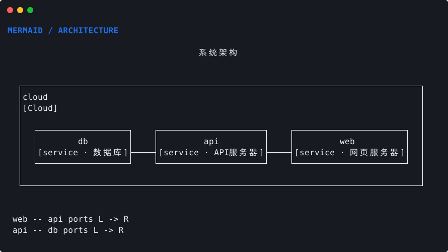</a>

</div>

`mermansi` renders Mermaid diagrams as deterministic ASCII or Unicode text for terminals,
CLIs, logs, markdown previews, and documentation. It uses [`merman-core`](https://crates.io/crates/merman-core)
0.8.0-alpha.3 as the single strict Mermaid parser and semantic source, reuses
[`merman-ascii`](https://crates.io/crates/merman-ascii) 0.8.0-alpha.3 for families where that
crate satisfies the contract, and implements native terminal adapters for every remaining
family.

## Features

- **All 28 `RenderSemanticModel` variants supported** — 33 pinned render parser IDs and 29
  fixture families (including the ZenUML-to-Sequence transform) are checked in 232 concise
  rendering combinations: English/Chinese, ASCII/Unicode, and 100/120 display columns.
- **One public source-to-text API** — `render_source(source, &options)` accepts Mermaid or a raw
  JSON object/array.
- **Complete or concise output** — keep the canonical semantic model for lossless inspection, or
  request only the readable preview with a structured fallback.
- **ASCII and Unicode output** — switchable charset with display-column-aware layout.
- **Optional ANSI color roles** — geometry-independent color that never breaks alignment.
- **Bounded allocations** — typed errors when source, canvas, or output limits are exceeded.
- **Deterministic output** — identical input always produces byte-identical output.
- **International labels** — English, Chinese (CJK wide), combining marks, and emoji all
  preserve geometry.
- **Terminal chart geometry** — Pie, Radar, QuadrantChart, and Venn render genuine
  deterministic canvas geometry (closed circles, radial spokes, Cartesian plotting areas,
  overlapping set outlines) rather than structured-text-only output.
- **Native flow and hierarchy geometry** — Sankey, Treemap, Ishikawa, Event Modeling, and Info
  render connected flow routes, proportional nested rectangles, fishbones, frame/data graphs,
  and compact information cards instead of tables or indentation outlines.
- **Native schedule and protocol geometry** — Gantt renders proportional dated task lanes and
  Packet renders closed proportional 32-bit field rows, including cross-row fields.
- **Native graph and UML geometry** — GitGraph renders branch/commit/merge lanes; Class renders
  compartment boxes and connected UML relationships; Block cycles use deterministic routed ports.
- **No Mermaid parser bundled** — uses `merman-core` as the single source of truth.

## Install

```sh
cargo install mermansi
```

## CLI usage

```sh
# Render from stdin
echo 'flowchart TD
  A --> B' | mermansi

# Render from a file
mermansi --file diagram.mmd

# ASCII charset
mermansi --file diagram.mmd --ascii

# With ANSI color
mermansi --file diagram.mmd --color

# Geometry only (recommended for terminal previews and recordings)
mermansi --file diagram.mmd --concise
```

### CLI flags

| Flag | Description |
|---|---|
| `--file <PATH>` | Read Mermaid source from a file (default: stdin) |
| `--ascii` | Use ASCII charset (default: Unicode) |
| `--unicode` | Use Unicode charset (default) |
| `--color` | Enable ANSI color roles |
| `--truecolor` | Enable 24-bit ANSI color roles |
| `--no-color` | Disable ANSI color (default) |
| `--concise` | Emit terminal geometry only |
| `--complete` | Emit geometry plus the canonical model (default) |
| `--width <N>` | Maximum output width in terminal columns |
| `--height <N>` | Maximum output height in terminal rows |
| `--version` | Print version and exit |
| `--help` | Print help and exit |

### Exit codes

| Code | Meaning |
|---|---|
| 0 | Success |
| 1 | Parse error |
| 2 | Render error |
| 3 | Invalid options or I/O error |

## Library API

```rust
use mermansi::{render_source, MermansiOptions};

let mermaid_text = r#"
flowchart TD
    A[Start] --> B{Decision}
    B -->|Yes| C[Do thing]
    B -->|No| D[End]
"#;

let output = render_source(mermaid_text, &MermansiOptions::unicode()).unwrap();
println!("{output}");
```

Presentation surfaces can omit the duplicate canonical model while retaining a structured
fallback for families without a readable preview:

```rust
use mermansi::{MermansiOptions, OutputMode, render_source};

let options = MermansiOptions::unicode().with_output_mode(OutputMode::Concise);
let output = render_source(mermaid_text, &options).unwrap();
```

Raw JSON objects and arrays use the same entry point and render as connected box-tree geometry.
The exact `flowchart-v2` parser-id header is normalized to the public `flowchart` grammar header,
then parsed by `merman-core` through its known-type API.

### Syntax boundaries

`rack-beta` is not a Mermaid 11.16 diagram family and is intentionally rejected; use
`architecture-beta` or `block-beta` for rack/infrastructure views. Field-definition diagrams use
the supported `packet-beta` family, whose strict syntax requires quoted labels such as
`0-3: "Version"`. Both nested deployment Flowcharts and `C4Deployment` are supported. Runnable
examples live under `tests/scenarios/`; the exact parser inventory and alternatives are documented
in `docs/SUPPORT_MATRIX.md`.

### Convenience functions

```rust
use mermansi::{render_source_ascii, render_source_unicode};

let ascii_output = render_source_ascii(mermaid_text).unwrap();
let unicode_output = render_source_unicode(mermaid_text).unwrap();
```

## Rendering gallery

`mermansi` outputs terminal text, not native SVG. Every image below is an
[ASG](https://github.com/kingsword09/asg) capture of real CLI output produced with
`mermansi --unicode --no-color --concise`, using a 95-column diagram budget inside a 100-column
terminal.
The canonical gallery uses Chinese fixtures so CJK display-width behavior is visible rather than
only asserted by tests. Select an image for its full-size SVG or select **source** for the Mermaid
fixture that produced it.

<details open>
<summary><strong>All 29 supported families</strong></summary>

<table>
<tr>
<td width="50%" valign="top"><strong>Architecture</strong> · <a href="tests/fixtures/architecture.zh.mmd">source</a><br><a href="docs/gallery/architecture.svg"></a></td>
<td width="50%" valign="top"><strong>Block</strong> · <a href="tests/fixtures/block.zh.mmd">source</a><br><a href="docs/gallery/block.svg">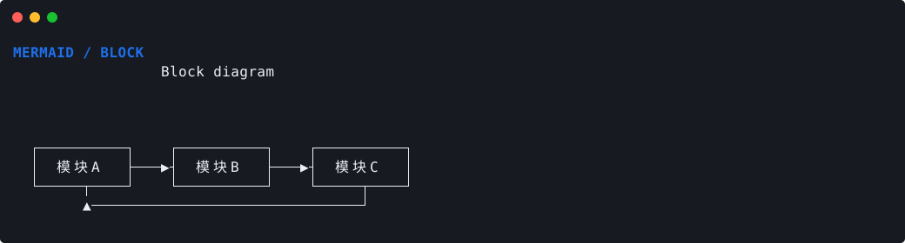</a></td>
</tr>
<tr>
<td width="50%" valign="top"><strong>C4</strong> · <a href="tests/fixtures/c4.zh.mmd">source</a><br><a href="docs/gallery/c4.svg">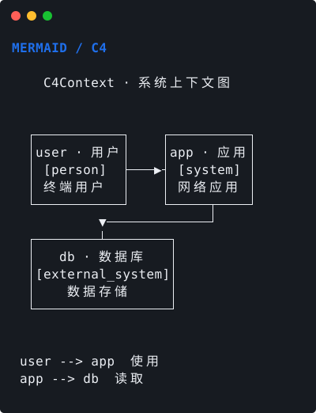</a></td>
<td width="50%" valign="top"><strong>Class</strong> · <a href="tests/fixtures/class.zh.mmd">source</a><br><a href="docs/gallery/class.svg">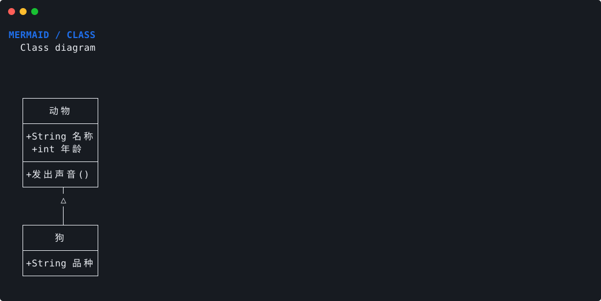</a></td>
</tr>
<tr>
<td width="50%" valign="top"><strong>Entity Relationship</strong> · <a href="tests/fixtures/er.zh.mmd">source</a><br><a href="docs/gallery/er.svg">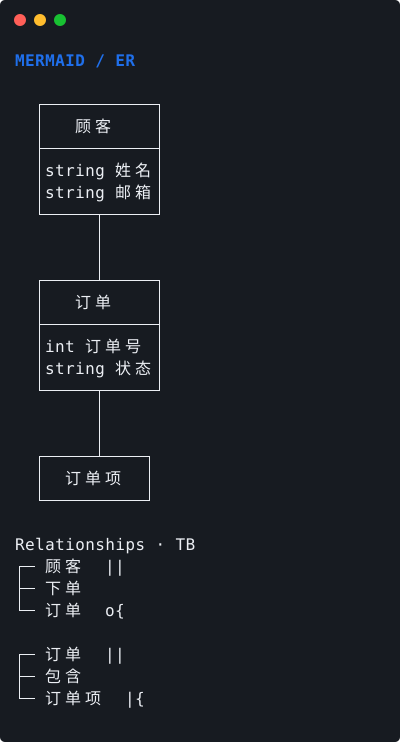</a></td>
<td width="50%" valign="top"><strong>Event Modeling</strong> · <a href="tests/fixtures/eventmodeling.zh.mmd">source</a><br><a href="docs/gallery/eventmodeling.svg">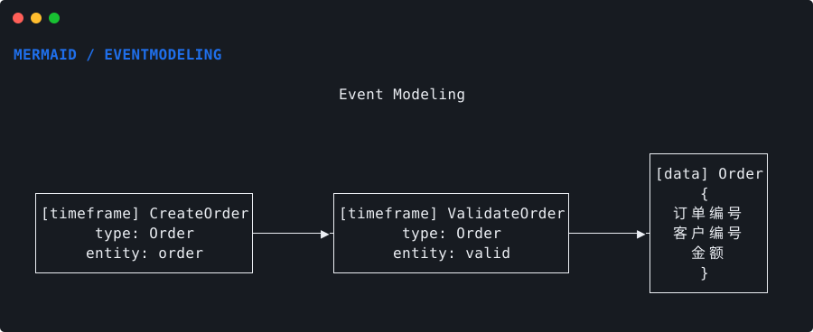</a></td>
</tr>
<tr>
<td width="50%" valign="top"><strong>Flowchart</strong> · <a href="tests/fixtures/flowchart.zh.mmd">source</a><br><a href="docs/gallery/flowchart.svg">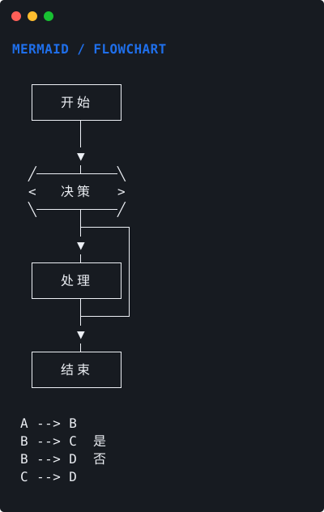</a></td>
<td width="50%" valign="top"><strong>Gantt</strong> · <a href="tests/fixtures/gantt.zh.mmd">source</a><br><a href="docs/gallery/gantt.svg">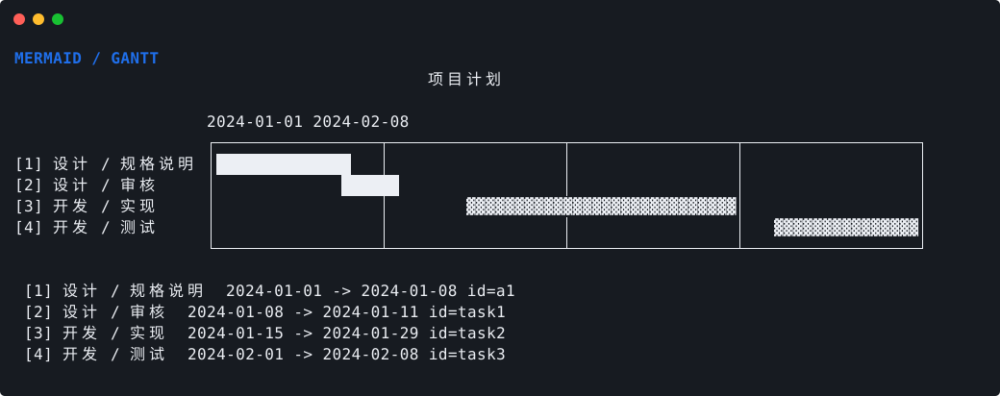</a></td>
</tr>
<tr>
<td width="50%" valign="top"><strong>GitGraph</strong> · <a href="tests/fixtures/gitgraph.zh.mmd">source</a><br><a href="docs/gallery/gitgraph.svg">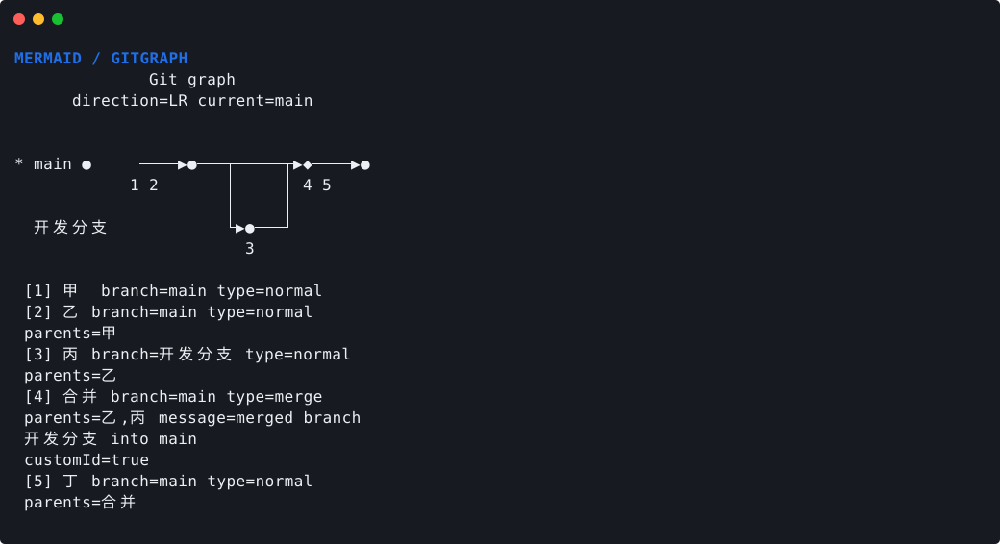</a></td>
<td width="50%" valign="top"><strong>Info</strong> · <a href="tests/fixtures/info.zh.mmd">source</a><br><a href="docs/gallery/info.svg">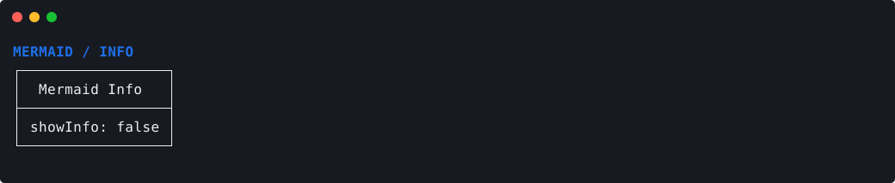</a></td>
</tr>
<tr>
<td width="50%" valign="top"><strong>Ishikawa</strong> · <a href="tests/fixtures/ishikawa.zh.mmd">source</a><br><a href="docs/gallery/ishikawa.svg">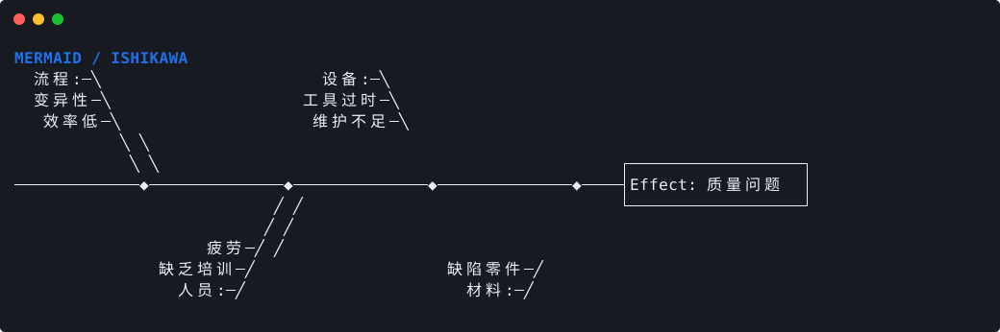</a></td>
<td width="50%" valign="top"><strong>Journey</strong> · <a href="tests/fixtures/journey.zh.mmd">source</a><br><a href="docs/gallery/journey.svg">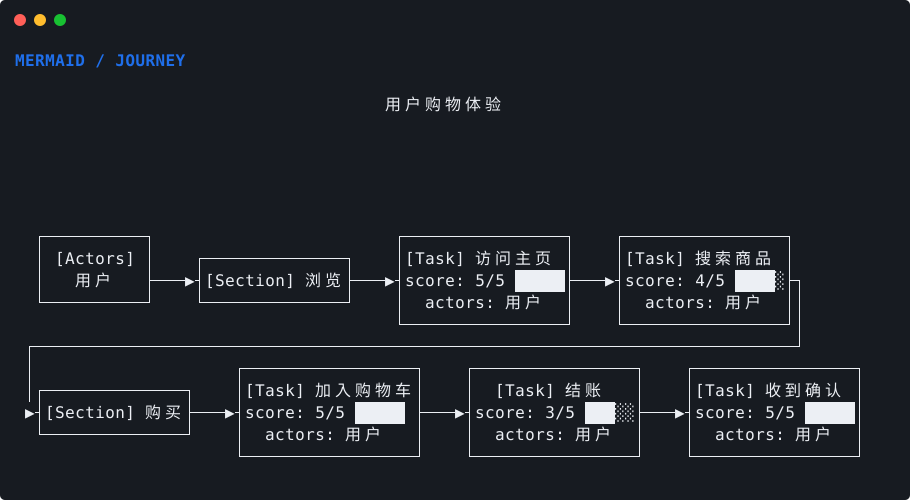</a></td>
</tr>
<tr>
<td width="50%" valign="top"><strong>JSON</strong> · <a href="tests/fixtures/json.zh.mmd">source</a><br><a href="docs/gallery/json.svg">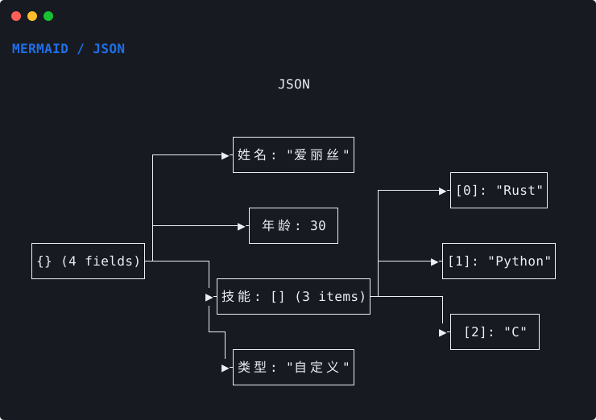</a></td>
<td width="50%" valign="top"><strong>Kanban</strong> · <a href="tests/fixtures/kanban.zh.mmd">source</a><br><a href="docs/gallery/kanban.svg">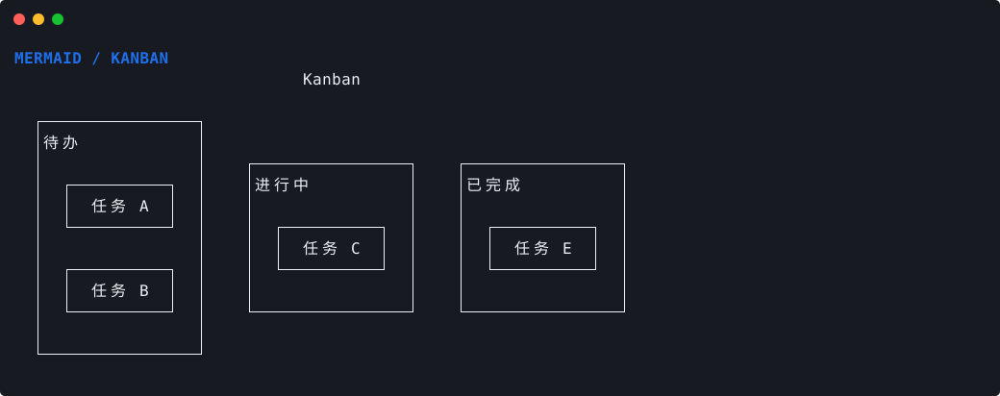</a></td>
</tr>
<tr>
<td width="50%" valign="top"><strong>Mindmap</strong> · <a href="tests/fixtures/mindmap.zh.mmd">source</a><br><a href="docs/gallery/mindmap.svg">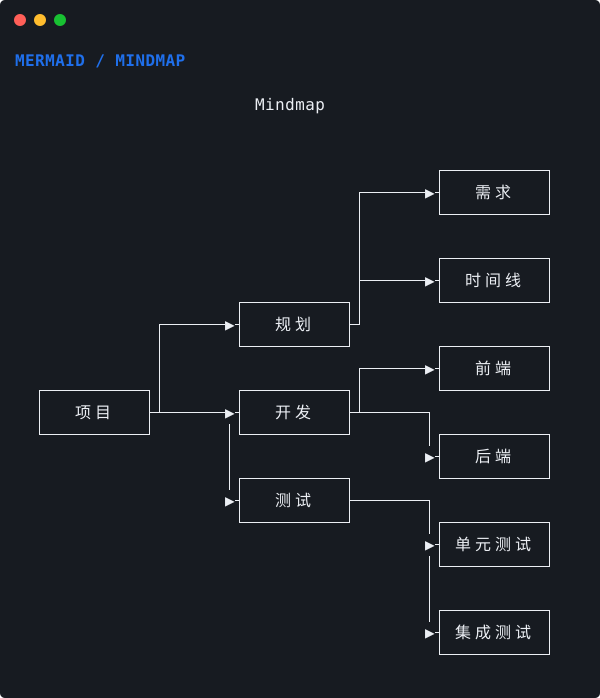</a></td>
<td width="50%" valign="top"><strong>Packet</strong> · <a href="tests/fixtures/packet.zh.mmd">source</a><br><a href="docs/gallery/packet.svg">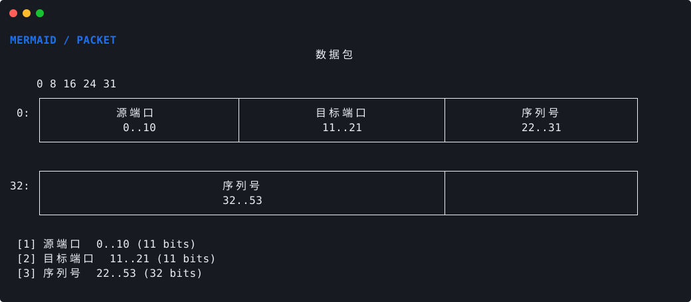</a></td>
</tr>
<tr>
<td width="50%" valign="top"><strong>Pie</strong> · <a href="tests/fixtures/pie.zh.mmd">source</a><br><a href="docs/gallery/pie.svg">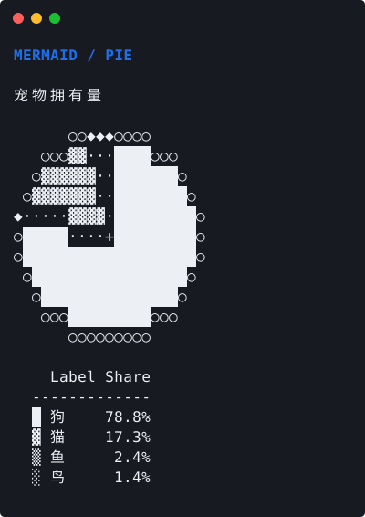</a></td>
<td width="50%" valign="top"><strong>Quadrant Chart</strong> · <a href="tests/fixtures/quadrant.zh.mmd">source</a><br><a href="docs/gallery/quadrant.svg">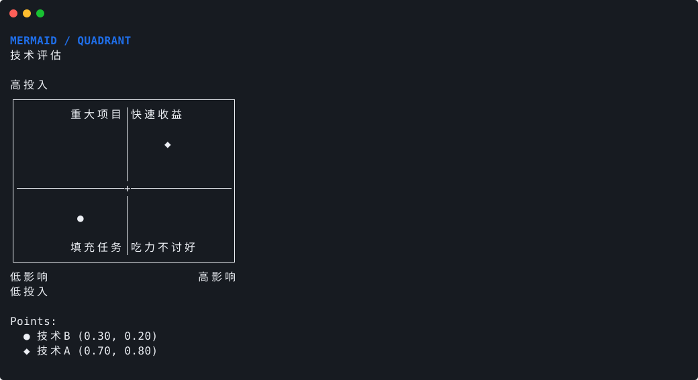</a></td>
</tr>
<tr>
<td width="50%" valign="top"><strong>Radar</strong> · <a href="tests/fixtures/radar.zh.mmd">source</a><br><a href="docs/gallery/radar.svg">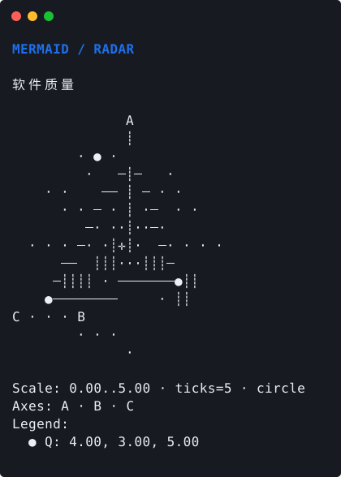</a></td>
<td width="50%" valign="top"><strong>Requirement</strong> · <a href="tests/fixtures/requirement.zh.mmd">source</a><br><a href="docs/gallery/requirement.svg">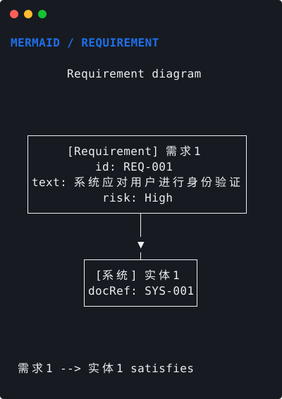</a></td>
</tr>
<tr>
<td width="50%" valign="top"><strong>Sankey</strong> · <a href="tests/fixtures/sankey.zh.mmd">source</a><br><a href="docs/gallery/sankey.svg">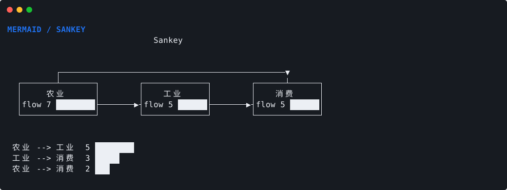</a></td>
<td width="50%" valign="top"><strong>Sequence</strong> · <a href="tests/fixtures/sequence.zh.mmd">source</a><br><a href="docs/gallery/sequence.svg">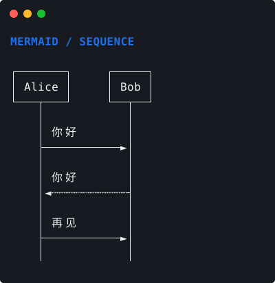</a></td>
</tr>
<tr>
<td width="50%" valign="top"><strong>State</strong> · <a href="tests/fixtures/state.zh.mmd">source</a><br><a href="docs/gallery/state.svg">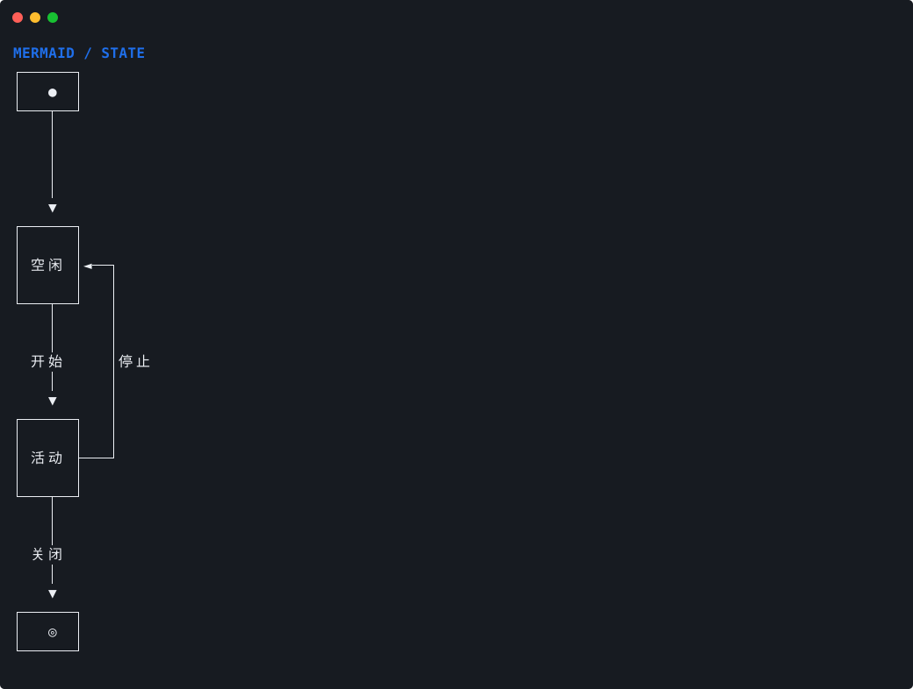</a></td>
<td width="50%" valign="top"><strong>Timeline</strong> · <a href="tests/fixtures/timeline.zh.mmd">source</a><br><a href="docs/gallery/timeline.svg">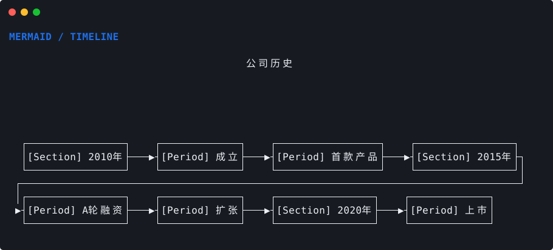</a></td>
</tr>
<tr>
<td width="50%" valign="top"><strong>Treemap</strong> · <a href="tests/fixtures/treemap.zh.mmd">source</a><br><a href="docs/gallery/treemap.svg">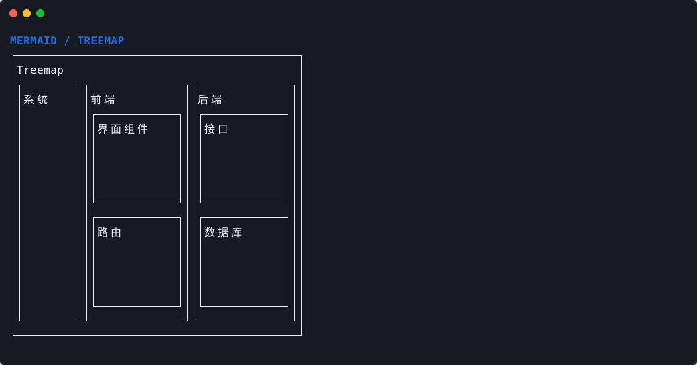</a></td>
<td width="50%" valign="top"><strong>TreeView</strong> · <a href="tests/fixtures/treeview.zh.mmd">source</a><br><a href="docs/gallery/treeview.svg">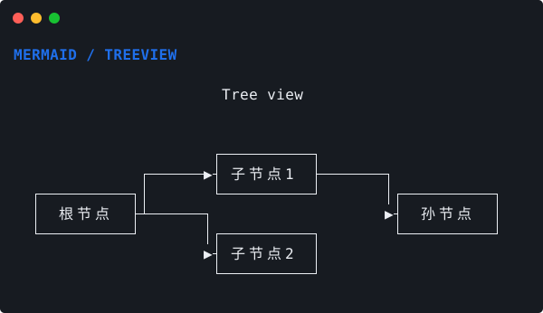</a></td>
</tr>
<tr>
<td width="50%" valign="top"><strong>Venn</strong> · <a href="tests/fixtures/venn.zh.mmd">source</a><br><a href="docs/gallery/venn.svg">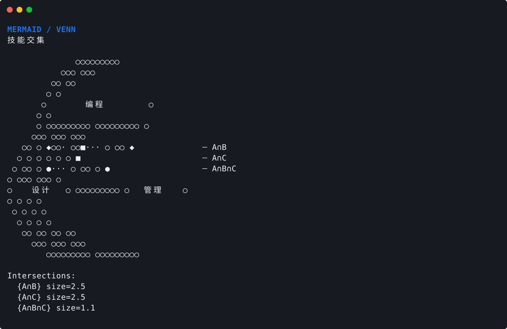</a></td>
<td width="50%" valign="top"><strong>XY Chart</strong> · <a href="tests/fixtures/xychart.zh.mmd">source</a><br><a href="docs/gallery/xychart.svg">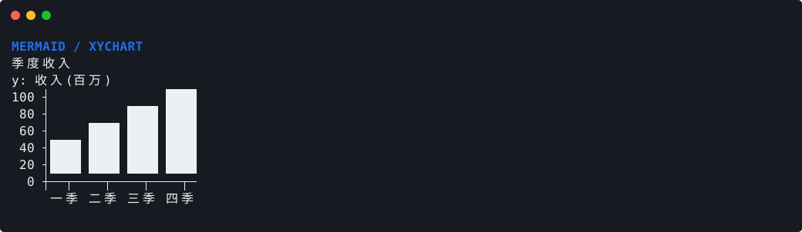</a></td>
</tr>
<tr>
<td width="50%" valign="top"><strong>ZenUML</strong> · <a href="tests/fixtures/zenuml.zh.mmd">source</a><br><a href="docs/gallery/zenuml.svg">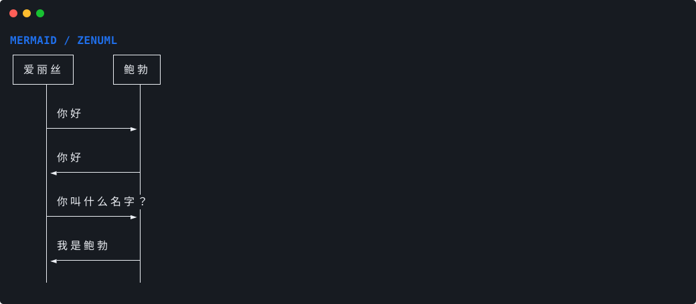</a></td>
<td width="50%"></td>
</tr>
</table>

</details>

<details>
<summary><strong>Complex scenarios (4)</strong></summary>

<table>
<tr>
<td width="50%" valign="top"><strong>Deployment Flowchart</strong> · <a href="tests/scenarios/deployment.flowchart.mmd">source</a><br><a href="docs/gallery/deployment-flowchart.svg">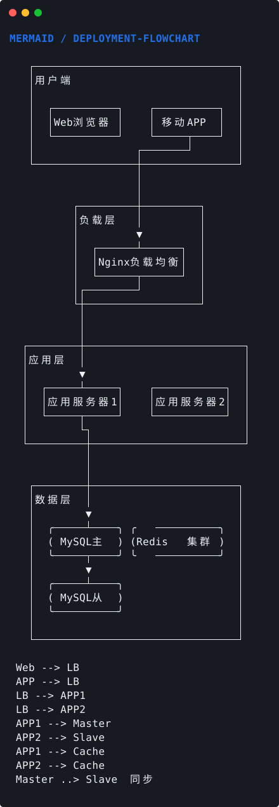</a></td>
<td width="50%" valign="top"><strong>C4Deployment</strong> · <a href="tests/scenarios/deployment.c4.mmd">source</a><br><a href="docs/gallery/deployment-c4.svg">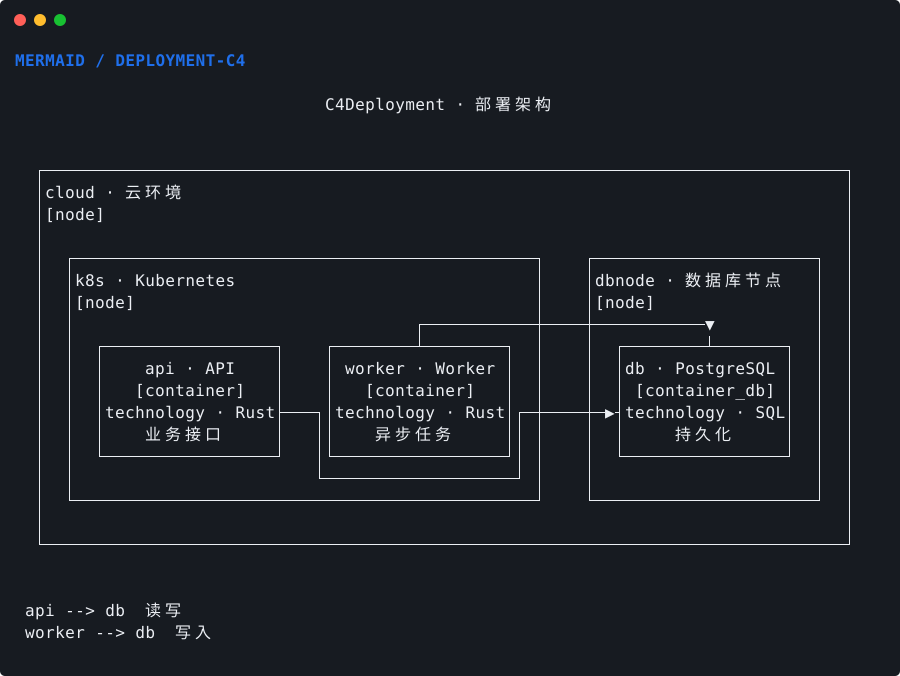</a></td>
</tr>
<tr>
<td width="50%" valign="top"><strong>IPv4 Packet</strong> · <a href="tests/scenarios/ipv4.packet.mmd">source</a><br><a href="docs/gallery/ipv4-packet.svg">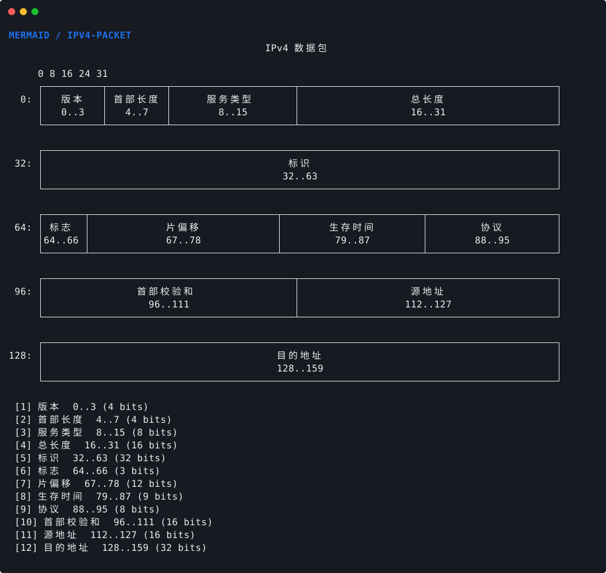</a></td>
<td width="50%" valign="top"><strong>Rack Architecture alternative</strong> · <a href="tests/scenarios/rack-alternative.architecture.mmd">source</a><br><a href="docs/gallery/rack-architecture-alternative.svg">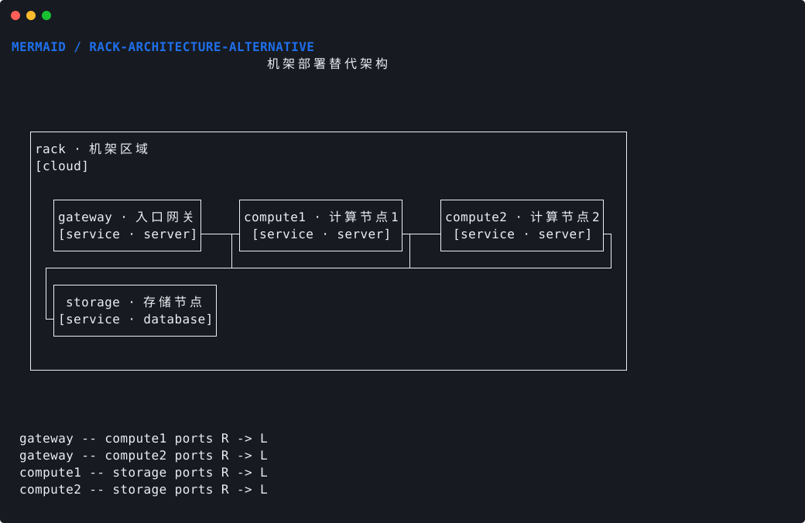</a></td>
</tr>
</table>

</details>

Regenerate the ignored audit workspace and refresh the tracked README assets only after the
33-image gate passes:

```sh
PUBLISH_README=1 ASG_BIN=/absolute/path/to/asg/target/release/asg scripts/asg-gallery.sh
```

## Support matrix

| Family | Support level | Renderer |
|---|---|---|
| Flowchart / graph | Geometry preview + canonical model | merman-ascii + mermansi |
| Sequence | Full geometry + canonical model | merman-ascii + mermansi |
| State | Partial geometry + canonical model | merman-ascii + mermansi |
| Class | Compartment/UML relationship geometry + canonical model | mermansi adapter |
| Er | Entity compartments and explicit cardinality routes + canonical model | mermansi adapter |
| Packet | Proportional closed bit-field geometry + canonical model | mermansi adapter |
| TreeView | Layered box-tree geometry + canonical model | mermansi adapter |
| XyChart | Partial geometry + canonical model | merman-ascii + mermansi |
| Mindmap | Layered box-tree geometry + canonical model | mermansi adapter |
| Gantt | Proportional dated task-lane geometry + canonical model | mermansi adapter |
| GitGraph | Connected branch/commit/merge geometry + canonical model | mermansi adapter |
| Journey | Connected scored task-path geometry + canonical model | mermansi adapter |
| Kanban | Nested board geometry + canonical model | mermansi adapter |
| Timeline | Connected period/event geometry + canonical model | mermansi adapter |
| ZenUML | Partial sequence geometry + canonical model | merman-ascii + mermansi |
| Json | Layered box-tree geometry + canonical model | mermansi adapter |
| Architecture | Nested box geometry + canonical model | mermansi adapter |
| C4 | Nested box geometry + canonical model | mermansi adapter |
| Pie | Circular sector geometry + legend | mermansi adapter |
| Requirement | Directional box geometry + canonical model | mermansi adapter |
| Sankey | Weighted connected flow geometry + canonical model | mermansi adapter |
| Radar | Radial spoke/graticule geometry + legend | mermansi adapter |
| Info | Closed information-card geometry + canonical model | mermansi adapter |
| Treemap | Proportional nested-rectangle geometry + canonical model | mermansi adapter |
| Block | Nested box and deterministic cycle geometry + canonical model | mermansi adapter |
| QuadrantChart | Cartesian quadrant geometry + legend | mermansi adapter |
| Ishikawa | Connected fishbone geometry + canonical model | mermansi adapter |
| EventModeling | Connected frame/data-box geometry + canonical model | mermansi adapter |
| Venn | Overlapping set-circle geometry + legend | mermansi adapter |

See `docs/SUPPORT_MATRIX.md` for the full machine-checkable support matrix.

## Deterministic output guarantee

`mermansi` guarantees that rendering the same Mermaid source text with the same options
always produces byte-identical output. This is verified by the test suite.

## License

MIT OR Apache-2.0
